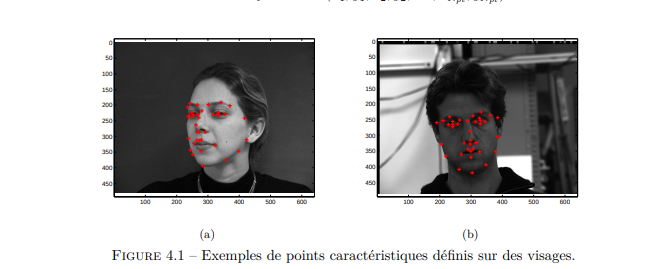

# Recherche sur les algorithmes existants

### Base initiale de la recherche:
----- 
- https://deepomatic.com/fr/comment-fonctionne-la-reconnaissance-dimage#:~:text=Il%20existe%20de%20nombreux%20algorithmes,%2C%20la%20r%C3%A9gression%20logistique%2C%20etc.
```
Il existe de nombreux algorithmes de classification d’images pour la reconnaissance d’images, tels que les poches de mots, les machines à vecteur de support (SVM), l’estimation des repères de visage (pour la reconnaissance faciale), les voisins les plus proches (KNN), la régression logistique, etc.
```

-----

- https://intelligence-artificielle.com/classification-d-image-guide-complet/

```
Les différents types de classification d’image:
- La classification non supervisée
    Dans la classification d'image supervisée, les algorithmes de machine learning utilisés ne sont pas pré-entraînés. Autrement dit, ils apprennent par eux-mêmes à analyser et à regrouper les données brutes. Un algorithme extrait des caractéristiques en fonction desquelles les étiquettes seront attribuées.

    Il existe deux algorithmes particulièrement connus pour la classification non supervisée qui sont « K-means » et « ISODATA »

- La classification supervisée
    Pour la classification d’image supervisée, les algorithmes sont donc pré-entraînés sur un ensemble d’images déjà étiquetées. Comme avec la classification non supervisée, l’algorithme extrait des caractéristiques à partir de la nouvelle image. Ensuite, il les compare à une liste de caractéristiques présélectionnées pour attribuer des étiquettes en fonction de celles-ci.
```

- La classification non supervisée
    Avantage:
    - Pas besoin d'avoir une base de données
    Désavantage:
    - Une grosse marge d'erreur

- La classification supervisée
    Avantage:
    - L'ia est mieux entrainé, donc moins de marge d'erreur
    Désavantage:
    - Besoin d'une très grosse base de données

-----


### Algorithme 1 - K-means
1. Utilisation / Fonctionnement

> https://fr.wikipedia.org/wiki/K-moyennes
```
Le principe se base sur une moyenne des valeurs identifier, ceux-ci ce regroupent en clusters, ainsi si un point et plus proche d'un cluster alors il sera considéré comme appartenant à ce cluster.
Donc on pourra identifier le type de plante en fonction de son appartenance au cluster.
```


Pour l'utilisation dans le cadre du projet je pense que les différences pouvant être exploitées:
- Différence de couleur
- Différence de superficie
- Différence de forme

2. Avantage
    - Simple de mise en place
    - Léger et très peu de calcul nécessaire au fonctionnement
    - Efficace et suffisant si les différences sont majeurs

3. Faiblesse
    - Marge d'erreur importante
    - Nécessite des plantes qui ne ressemble pas au datura
    - Les différences doivent être très importantes

4. Exemple d'utilisation
    - Compression d'image
    - Détection d'objet trés differents
    - Détction par couleur

<br>

### Algorithme 2 - SVM (machine à vecteur de support) 
1. Utilisation / Fonctionnement

> https://fr.wikipedia.org/wiki/Machine_%C3%A0_vecteurs_de_support
```
Le principe de l'algorithme se base sur la séparation des valeurs de l'image, par exemple la taille de la plante, la couleur etc. Le but est de récupérer les valeurs d'un côté unique(l'hyperplan). Afin de différencier les images.
```


Pour l'utilisation dans le cadre du projet je pense que les différences pouvant être exploitées:
- Différence de couleur
- Différence de superficie

2. Avantage
    - Pas besoin d'un réseau neuronal
    - Plus performant qu'un réseau neuronal si les différences sont importantes
    - Pas besoin d'un entrainement important

3. Faiblesse
    - Nécessite de grosses différences (pas sûr que la différence des plantes soit suffisante)
    - Nécessite de quantifié les différences
    - Marge d'erreur possible si les différences sont trop minime

4. Exemple d'utilisation

> https://dataanalyticspost.com/Lexique/svm/

<br>

### Algorithme 3 - Estimation des repères
1. Utilisation / Fonctionnement

> https://tel.archives-ouvertes.fr/tel-00560836/document

```
L'algorithme se base sur le placement de repères facilement reconnaissables (sur l'image les yeux, le nez et le menton).

La détection des points et leurs écarts permettent ainsi de connaître l'orientation des visages, mais aussi de reconnaître un visage en fonction de l'écart des points.
```



Pour l'utilisation dans le cadre du projet:
- Détecter les formes des feuilles, pour reconnaître la fleur
- Détecter la forme des fleurs, pour reconnaître la forme des fleurs
- Ça permet aussi de connaître l'âge de la plante

2. Avantage
    - Performant et efficace
    - Facile de repérer les différences entre deux plantes
    - Permets de connaître la maturation d'une plante

3. Faiblesse
    - nécessite des rensemblances importantes entre les plantes de même famille
    - nécessite que les plantes ne se ressemblent pas 
    - la couleur de la plante n'est pas pris en compte

4. Exemple d'utilisation
    - FaceID
    - Détection de l'orientation d'objet

<br>

### Algorithme 4 - Voisins les plus proche (KNN)

1. Utilisation / Fonctionnement

> https://datascientest.com/knn#:~:text=L'algorithme%20des%20K%20plus,de%20classification%20et%20de%20r%C3%A9gression.

```
On donne en paramètre des images dont on connaît déjà le type, afin d'entrainer l'algorithme.
Durant l'entrainement l'algorithme va modifier l'importance (poids) des différents éléments de l'image afin de trouver petit à petit comment différencier si c'est ou non l'objet recherché.
```


Pour l'utilisation dans le cadre du projet:
- Comparer des images de datura et d'autres plantes. (laisser faire l'agorithme)
- Comparer des parties uniques, feuille, fleur, etc.

2. Avantage
    - Simple d'implémentation
    - Déjà fait c'est preuve pour les plantes (explication dans le document montré)
    - Le programme se configure tout seul, afin d'évaluer les différences (calcul de poids)

3. Faiblesse
    - Nécessite de grande base de données pour entrainer au maximum l'algorithme
    - Il peut faire des erreurs de détections en fonction des images de tests
    - Long à entrainer

4. Exemple d'utilisation
    - Détection du type d'animal
    - Détection des émotions de quelqu'un


### Algorithme 5 - Regression logistique
1. Utilisation / Fonctionnement

> https://docs.microsoft.com/fr-fr/analysis-services/data-mining/microsoft-logistic-regression-algorithm?view=asallproducts-allversions

> https://datascientest.com/regression-logistique-quest-ce-que-cest

> https://medium.com/swlh/logistic-regression-for-image-classification-e15d0ae59ce9

> https://www.quora.com/Are-KNN-and-logistic-regression-the-same-thing


```
La régression logistique ressemble au fonctionnement du knn, la principale différence se base sur l'évaluation des résultats.

Dans le cas du knn, l'algorithme nous permet de nous dire si une image est datura ou non. Tant dit que dans le cas de la régression logistique on évalue toutes les possibilités, et on évalue la probabilité que l'image soit telle ou telle possiblité.

Dans l'exemple des nombres au-dessus, on va dans un premier temps étudié les nombres entre eux, tous les 0 entre eux, de même pour les autres. Ensuite on va faire une probabilité que notre nombre soit l'un ou l'autre.

```

Pour l'utilisation dans le cadre du projet:
- Comparer des parties uniques, feuille, fleur, etc

2. Avantage
    - Permets d'identifier la plante avec d'autre plantes, donc une plus faible source d'erreurs
    - Simple d'implémentation
    - Le programme se configure tout seul, afin d'évaluer les différences (calcul des coefficients logistiques)

3. Faiblesse
    - Nécessite de grande base de données pour entrainer au maximum l'algorithme
    - Pose des problèmes d'interprétation pour les plantes non connu
    - Long à entrainer et à fonctionner

4. Exemple d'utilisation
    - Détection de texte sur une image
    - Détection langage des signes


### Algorithme 6 - Détection de contour
1. Utilisation / Fonctionnement
> https://fr.wikipedia.org/wiki/D%C3%A9tection_de_contours


```
La détection de contours, ce base sur le changement de l'image en noir et blanc, une fois celui-ci effectué.
Il est donc facile de comparer la forme des différents objets afin de reconnaître le forme globale de la plante.
```

Pour l'utilisation dans le cadre du projet:
- Détecter la forme des feuilles pour savoir si même feuille

2. Avantage
    - Permet de séparer les différents items sur une image
    - Simple d'implémentation
    - Ne prends pas en compte les variations de couleurs de la plante en cas de manque d'eau

3. Faiblesse
    - Gestion des variation compliqué
    - Gestion de plusieurs daturas sur une même image possible
    - Si obtruaction partiel du contour de la plante, source d'erreur possible

4. Exemple d'utilisation
    - Détection des formes
    - Détection de texte


#  Lister les forces / faiblesses que doit / ne doit pas posséder l'algorithme

### Mise en situation

Avant de réussir à définir les caractéristiques de l'algorithme optimal, il nous faut redéfinir la situation et les problèmes qui peuvent se poser à notre situation:


Nous travaillons sous certaines conditions particulières:
1. La prise de l'image du drone se fait en vue de haut
2. Plusieurs plantes peuvent se trouver sur la même image
3. Les plantes peuvent se mélanger (ex: un pissenlit et un datura peuvent pousser au même endroit)
4. La marge d'erreur est non négligeable
5. La détection de la plante doit se faire le plus tôt dans le développement de la plante

### Impacte sur l'algorithme

<br>


<br><br>

<b>POINT 1:</b>
Le dessous et le côté des plantes ne sont pas exploitables, ainsi certains points de vue ne sont pas exploitables. Dans l'image présentée au-dessus, l'intérieur de la fleur ne pourrait pas être exploitable.

Ainsi l'algorithme devra être assez adaptatif face à l'identification de la plante, et devra surement se baser sur plusieurs points/caractéristiques.

L'une des meilleures pistes d'identification se trouve dans les feuilles de la plante, comme les feuilles servent à capter le soleil, afin de nourrir la plante, elles seront en grande partie orientées vers le haut, correspondant à notre domaine d'étude.

<b>POINT 2 & 3:</b>
La complexité des plantes, que ce soit par leurs formes variables (taille, expansion de la plante, forme, etc) ou bien par la complexité des plantes autour, il peut être compliqué d'identifier les plantes sur la globalité de la plante.

Ce point est un gros problème pour beaucoup d'algorithme d'identification: cela concerne une bonne partie des algorithmes non supervissés (présentés en introduction), mais surtout les algorithmes utilisant des caractéristiques spécifiques de la plante (le volume, la couleur, la forme globale, etc).

Ainsi un algorithme qui pourrait se focaliser que sur une partie de la plante, sans prendre en compte le reste de la plante pourrait être un grand atout (par exemple: les fleurs, les feuilles, les fruits, etc).

<b>POINT 4:</b>
La marge d'erreur est non négligeable du fait qu'on touche au domaine de l'alimentaire. 

Ainsi nous devons éviter le plus de source d'erreurs possibles, ainsi les algorithmes non supervisés sont à évité du fait de leur marge d'erreur importante.

Il faut donc préconiser les algorithmes utilisant des bases de données afin de pouvoir entrainé au maximum l'algorithme avant de le mettre en circulation. 

<b>POINT 5:</b>

Notre objectif est d'identifier la plante le plus tôt possible, afin d'éviter les graines du datura et donc que la plante puisse se reproduire.

Ainsi certaines parties de la plante ne peuvent pas être exploitées comme la fleur ou bien le fruit.

Donc l'algorithme ne doit pas avoir besoin de se baser sur ce point


# Comparer les algorithmes

Dans un premier temps nous allons mettre en place un tableau afin d'identifier si les algorithmes correspondent aux points précédement noté:

| Algorithme            	| Point 1 	| Point 2-3 | Point 4 	| Point 5 	|
|------------------------	|---------	|---------	|---------	|---------	|
| Kmeans                	|   Oui    	|  Non     	|Non       	|Oui/Non   	|
| SVM                   	|   Oui  	|  Non     	|Non       	|Oui/Non   	|
| Estimation des repéres 	|   Oui    	|  Oui     	|Oui/Non   	|Oui       	|
| KNN                   	|   Oui    	|  Oui     	|Oui      	|Oui    	|
| Regression logistique  	|   Oui   	|  Oui     	|Oui       	|Oui    	|
| Détection de contours    	|   Oui    	|  Oui/Non 	|Non       	|Oui       	|

Avec ce tableau on se rends compte que certains algorithmes ne peuvent pas être utilisé dans ce projet, du coup pour la suite on va se baser sur les algorithmes valables:
- Estimation des repéres
- KNN
- Regression logistique

### Évalutation des points négatifs

##### 